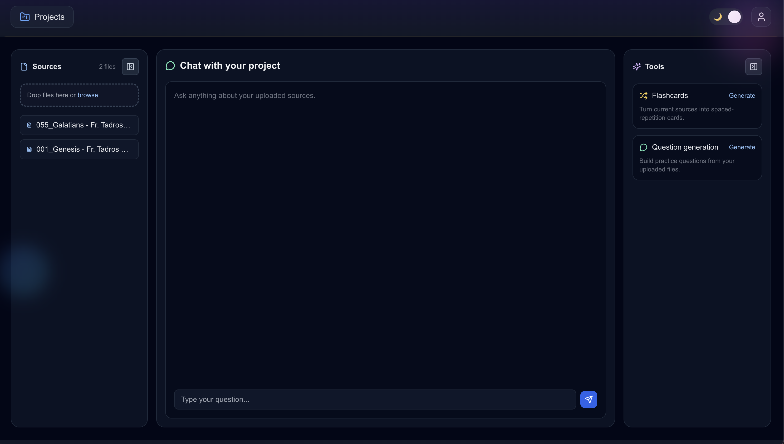

# StudyMate AI

<div align="center">
  
</div>

Full-stack learning workspace with project-based source uploads, Gemini embeddings into Pinecone, and a chat-first dashboard for interacting with your files. The repository is split into two apps:

- `back-end/` — Express + MongoDB + Pinecone + Google Gemini for ingesting files, extracting text, generating embeddings, and storing project/file metadata.
- `front-end/` — Next.js 14 + TypeScript + Tailwind for the dashboard UI, file upload flows, and project management.

## Features

- Create projects and upload multi-format sources (PDF, DOC/DOCX, XLS/XLSX, CSV, TXT) with text extraction and embeddings.
- Vector storage per project using Pinecone; embeddings via Google Gemini (`text-embedding-004`).
- Auth-protected project listing, file listing, and upload endpoints.
- Dashboard with sources sidebar, chat pane, and tools sidebar (flashcards and question generation placeholders).
- Responsive layout with collapsible sidebars and light/dark themes.

## Tech Stack

**Front-end**

- Next.js 14 (App Router), TypeScript
- Tailwind CSS, Radix UI, lucide-react icons
- next-themes for light/dark

**Back-end**

- Node.js, Express, Multer (uploads)
- MongoDB + Mongoose
- Pinecone (vector DB)
- Google Gemini embeddings (`@google/generative-ai`)
- PDF/Doc extraction: pdf-parse, mammoth, node-xlsx, csv-parser, tesseract (OCR fallback)

## Local Setup

### Prerequisites

- Node.js 18+ recommended
- MongoDB instance (local or Atlas)
- Pinecone index (dimensions 768 for Gemini text-embedding-004)
- Google Gemini API key

### Environment

Create `back-end/.env` with:

```
MONGO_URI=...
JWT_SECRET=...
PINECONE_API_KEY=...
PINECONE_INDEX_NAME=file-embeddings
GEMINI_API_KEY=...
```

Optional: adjust any CORS origins in `back-end/index.js`.

### Install & Run

Back-end:

```bash
cd back-end
npm install
npm run dev
```

Front-end:

```bash
cd front-end
npm install
npm run dev
```

Set `NEXT_PUBLIC_backend_url` in `front-end/.env.local` to point to your API (e.g., `http://localhost:3005`).

## Screenshot

The screenshot above is referenced from `docs/dashboard-preview.png`. Place the provided image in that path (or update the link) so the preview renders in the README.

## Contributing

1. Create a branch
2. Make changes with linting/formatting
3. Open a PR describing updates and testing steps

## License

MIT.
